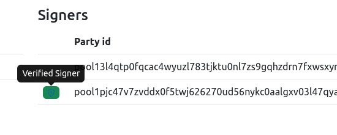
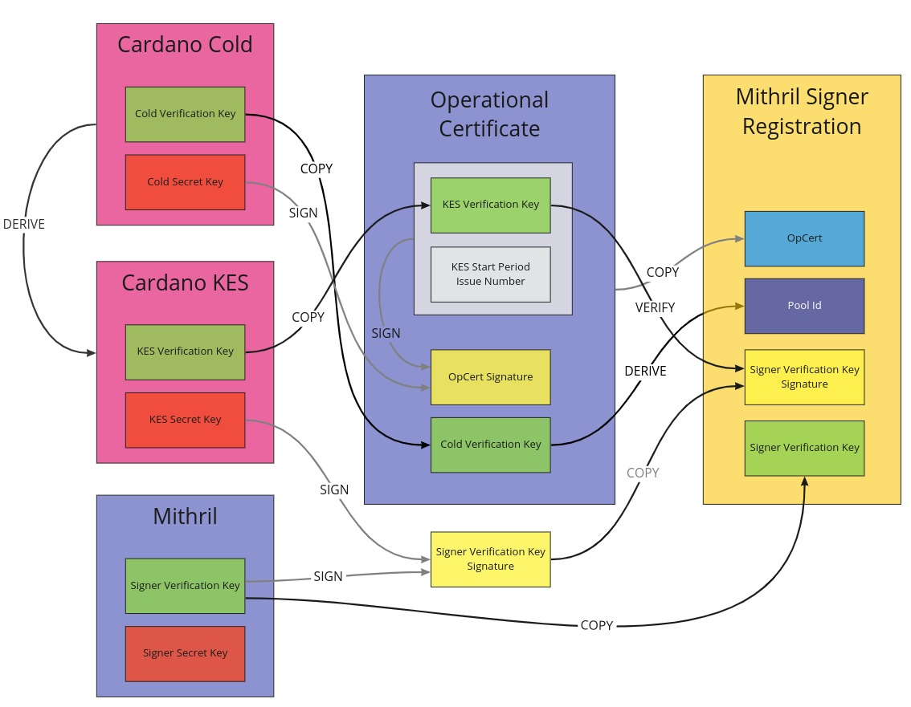

### The way the Mithril nodes handle the Certification of the SPOs is evolving

**PR**: `New STM registration procedure` [#433](https://github.com/input-output-hk/mithril/pull/433)

**Issues**: `Implement Certification of the Mithril Verification Keys in Signer/Aggregator` [#455](https://github.com/input-output-hk/mithril/issues/455)

We have released a new Mithril Signer Verification Keys Certification mechanism:

- Mithril Signer nodes running the previous version are still able to interact with the network without any further intervention
- Mithril Signer nodes that are updated from a previous version must migrate some of their stores
- This mechanism is **experimental** and can be activated on demand by the SPOs

#### Upgrade a Mithril Signer running a previous version

The SPOs need to recompile their Signer node (as in this [guide](https://mithril.network/doc/manual/getting-started/run-signer-node)).

The data stores of the node need to be updated by running the following command:

```bash
# The path to your data stores directory, which defaults to:
DATA_STORES_DIRECTORY=/opt/mithril/mithril-signer/stores

# Run this command to upgrade your stores:
sqlite3 ${DATA_STORES_DIRECTORY}/signer.sqlite3 "UPDATE protocol_initializer SET value = json_object('stm_initializer', json(value), 'kes_signature', null) WHERE json_extract(value, '$.stm_initializer') IS NULL;"
```

:warning: If you don't update your data stores with this procedure, your node will not be able to register to the Aggregator temporarily. It should then take up to `3` epochs before it is able to successfully register its individual signatures with the Aggregator.

#### Hybrid Certification mode in the Mithril network

From now, SPOs can either run their node by:

- **Declaring their Cardano `PoolId`**:

  - This is the mode that all nodes were running prior to this release
  - This mode is still the **stable** mode
  - We intend to deprecate this mode in the near future

- **Certifying their Cardano `PoolId`**:

  - The certification is done by providing the Mithril Signer node with `KES Secret Key Path` and `Operational Certificate Path`
  - This is an **experimental** mode
  - We intend to make this mode the only way of providing a `PoolId` in the near future
  - These `PoolIds` will be marked with a `Verified Signer` green badge in the [Mithril Explorer](https://mithril.network/explorer/) (`2` epochs after activating the Certification mode)

The setup of a Mithril Signer node with these two modes is available in this [guide](https://mithril.network/doc/manual/getting-started/run-signer-node).

Here is an example of the `Verified Signer` badge displayed in the Certificate details popin:


#### How Keys Certification works

We rely on the Cardano `KES Keys` and `Operational Certificate` to be able to:

- Compute automatically the `PoolId` from a valid `Operational Certificate`
- Sign the `Mithril Signer Verification Key` with the `KES Secret Key`
- Verify that the `Mithril Signer Verification Key` is associated to the owner of the pool



Feel free to reach out to us on the [Discord channel](https://discord.gg/5kaErDKDRq) for questions and/or help.
