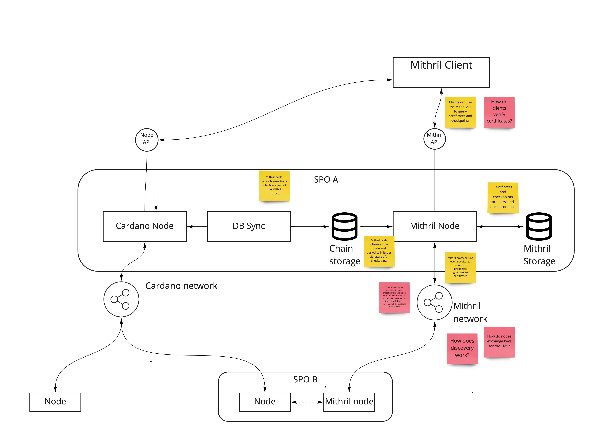

# Mithril Network

The following figure sketches of our current understanding of the Mithril network architecture.

* Mithril nodes are operated alongside Cardano nodes and read a feed of transactions/blocks from the Chain storage, stored in a Postgres DB and updated through DB Sync service
* Mithril nodes are interconnected through a dedicated Mithril network providing both broadcast and unicast capabilities
* This implies some form of discovery/address lookup/setup phase to form the network of nodes
* This network is independent from the main Cardano network which is used by Cardano nodes to exchange transactions and blocks information
* Mithril nodes store state, including keys, stakes, signed certificates, and snapshots of UTxO set in some persistent Mithril storage
( Signing keys should probably be stored independently using some secure storage options (KMS/HSM)
* A Mithril node exposes an API that can be used by a Mithril-aware client to:
  * Retrieve a sequence of valid certificates
  * Retrieve latest multi-signed UTxO set
* Once primed with a valid UTxO set, clients can use the Cardano node API to receive updates (transactions/blocks)
  > This implites clients should maintain some form of chain state of their own independent of a Cardano node. Alternatively, a Cardano node could be primed with a specific UTxO set?
