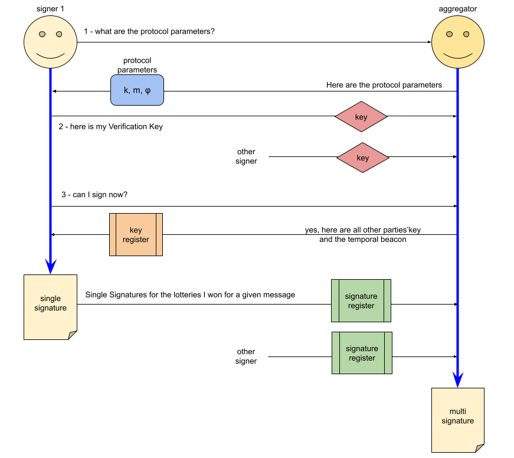

# Mithril Signer Node

Welcome to the Mithril Signer Node guide!

## Introduction

:::info

The **Mithril Signer** is a node that works transparently on top of the **Stake Pool Operator** Cardano nodes and which individually signs the ledger state.

:::

:::tip

* For more information about the **Mithril Protocol**, please refer to the [Protocol in depth](../mithril-protocol/protocol.md) page.

* For more information about the **Mithril Signer**, please refer to the [Developer Documentation](../../manual/developer-docs/nodes/mithril-signer.md) page.

:::

## Individual Signatures Production

The **Mithril Signer** is a node that represents a share of the total stake of the **Cardano Network** which entitles it to participate in the **Mithril multi signature** creation (with respect to its share of total stakes). The rule is simple, the more stake shares, the more contribution to the production of the multi signatures.

In order to produce an **Individual Signature** a **Mithril Signer** must also be aware of all the other **Mithril Signers** that may contribute.

For the protocol to be secure, the **Mithril Signer** must also be in charge of computing by itself the messages (or digest) that are signed. To do so, they heavily rely on the **Consensus** mechanism of the **Cardano Network** that guarantees that all nodes of the network will store the same data locally (after a certain delay).

If some nodes are not fully synchronized or if they have adversarial behavior they will simple not be able to contribute:
  
* Either because they don't sign the same message (given they don't use the same data as those agreed by the rest of the network)

* Or they are not entitled to sign (because they are not true holders of the stake share they used to sign)

## Interaction with the Mithril Aggregator

In its first version, the **Mithril Signer** works with other **Mithril Signers** through one **Mithril Aggregator** which acts as a facilitator and avoids direct signer to signer communications.

In the long run, any signer will also have the ability to be a **Mithril Aggregator** as well in order to achieve a higher level of decentralization in the **Mithril Network**.

The **Mithril Signer** connects to the **Mithril Aggregator**:

* To know when to sign a new snapshot (by using the advertised **Beacon** of the **Pending Certificate**).
* To retrieve the currently used **Protocol Parameters**.
* To register its **Verification Keys** (public keys).
* To receive the **Verification Keys** of all the other declared signers available for the next message to sign.
* To send the **Single Signatures** of the locally computed messages (that will hopefuly be combined into **Multi signatures** by the aggregator).

This process is summarized in the following diagram:

## Under the hood

In its first version, the **Mithril Signer** is composed of a main component:

* A runtime that is powered by a state machine:
  * The runtime is synchronous and is scheduled to execute at regular intervals.
  * There are three possible states: **UNREGISTERED**, **REGISTERED** and **SIGNED**.
  * The runtime handles state transitions.
  * The runtime is summarized in the diagram below:

