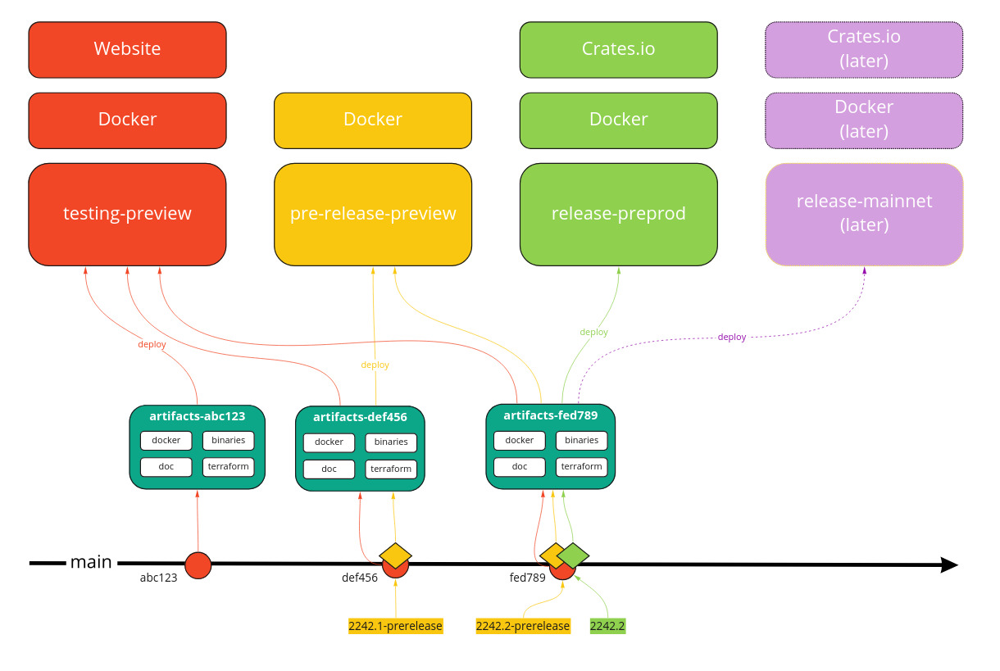

## Status

**draft**

## Context

In order to deliver regularly the software to our users, we should implement a release process based on a predictable versioning scheme. 

### Versioning

A Release Version determines a distribution of determined node versions and underlying libraries.

 * Our softwares must be able to interact seamlessly with other Mithril software.
 * Our softwares must be able to be hosted on crates.io.
 * Our softwares must clearly indicate compatibility with other Mithril components to end users.
 

### Release process

A Release is a software package that is built once and then promoted from the testing environment to the production environment. It can be signed.

 * Keep it simple.
 * Automated as much as possible: all points not requiring human decision shall be automated.
 * Minimize the mean time to release.

## Decision

There are 3 versioned layers in the Mithril stack:

 * HTTP API protocol to ensure compatibility in the communication between nodes (use Semver).
 * Crate version: each node & library has its own version (use Semver). The commit digest is automatically added to the version by the CI pipeline.
 * Release Version: the distribution version (use version scheme **YYWW.patch** | **YYWW.patch-name**). The VERSION file is computed by the pipeline from the tag release.

The documentation is tied to a Release Version.

### Release Process

Starting just after a new release has been made:

1. Develop on a dedicated development branch.
1. When merging PR on main: update the `Cargo.toml` files with version of the updated nodes.
1. Once merged, the CI creates an `unstable` tag & release which is deployed on testing environment.
1. Push a tag using the distribution version format on this commit with a `-prerelease` suffix.
1. The CI gets the built artifacts associated with this commit and generates a named pre-release which is deployed on `pre-release` for testing.
1. Push a tag using the distribution version format on this commit without the `-prerelease` suffix.
1. The CI gets the built artifacts associated with this commit and generates a named release which is deployed on `pre-release` for testing.
1. In the release GitHub interface, edit the newly generated release, uncheck the `This is a pre-release` checkbox.
1. The CI gets the built artifacts associated with this commit and generates a named release which is deployed on `release`.
1. Create a commit:
   1. to promote the documentation website from future to current.
   1. to update the SQL schema with alterations from the previous release.

### Hotfix Release
​
In case of a blocking issue (following a distribution release) on the release environment that requires an immediate fix:
​
1. Create a branch on the last release tag with the following scheme: `hotfix/{last_distribution-version}.{last_patch_number + 1}`.
1. Development of the fix is done on this branch.
1. After each commit on this branch, the CI creates an `unstable` tag & release which is not deployed on testing environment (testing must be done on an ad hoc environment manually created).
1. Push a tag on the branch last commit using the branch distribution version with a `-hotfix` suffix.
1. The CI gets the built artifacts associated with this commit and generates a named pre-release which is deployed on `pre-release` for testing.
1. In the release GitHub interface, edit the newly generated release, uncheck the `This is a pre-release` checkbox.
1. The CI gets the built artifacts associated with this commit and generates a named release which is deployed on `release`.
1. Merge the hotfix branch on main branch (and adapt the changes if they are not compatible with the current main branch).

