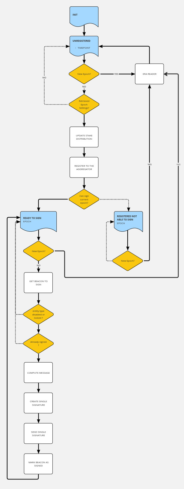

# Mithril signer node

:::info

The Mithril signer is a node that works transparently on top of the stake pool operators' Cardano nodes. It is responsible for independently signing the ledger state.

:::

:::tip

- For more information about the **Mithril protocol**, see the [protocol in depth](../mithril-protocol/protocol.md) overview.

- For more information about the **Mithril signer**, see the [developer manual](../../manual/developer-docs/nodes/mithril-signer.md).

:::

## Individual signature production

The Mithril signer is a node representing a portion of the total stake within the Cardano network. This permits it to engage in Mithril multi-signature creation in proportion to its stake share. The principle is straightforward: a greater stake share corresponds to a more substantial contribution to the production of multi-signatures.

To produce an individual signature, a Mithril signer must also be aware of all the other Mithril signers that can potentially contribute.

For the protocol to maintain its security, the Mithril signer must autonomously compute the messages (or digests) that require signing. To accomplish this, the signer heavily depends on the **consensus** mechanism of the Cardano network, which ensures that all network nodes locally store identical data (following a specific delay).

If certain nodes are not fully synchronized or exhibit adversarial behavior, they will be unable to contribute, either:

- Because they do not sign the same message (as they use different data from what the rest of the network agrees upon)
- Or they are not entitled to sign (because they are not true holders of the stake share they used to sign).

## Interaction with the Mithril aggregator

In its initial version, the Mithril signer collaborates with other Mithril signers through a central Mithril aggregator that serves as a facilitator, avoiding the necessity for direct signer-to-signer interactions.

Ultimately, any signer will have the potential to function as a Mithril aggregator, enhancing decentralization within the Mithril network.

The Mithril signer establishes a connection with the Mithril aggregator for the following purposes:

- Determining when to sign a new snapshot (via the advertised beacon of the pending certificate)
- Obtaining the presently used protocol parameters
- Registering its verification keys (public keys)
- Receiving the verification keys of all other declared signers, available for the upcoming message signing
- Sending the single signatures of locally computed messages (which will ideally be combined into multi-signatures by the aggregator).

This process is summarized in the following diagram:

## Under the hood

In its initial version, the **Mithril signer** consists of a primary component:

- A runtime powered by a state machine:
  - The runtime operates synchronously and is programmed to run at consistent intervals
  - Four potential states exist: **INIT**, **UNREGISTERED**, **READY TO SIGN** and **REGISTERED NOT ABLE TO SIGN**.
  - The runtime effectively manages state transitions
  - The runtime's framework is depicted in the diagram below:

